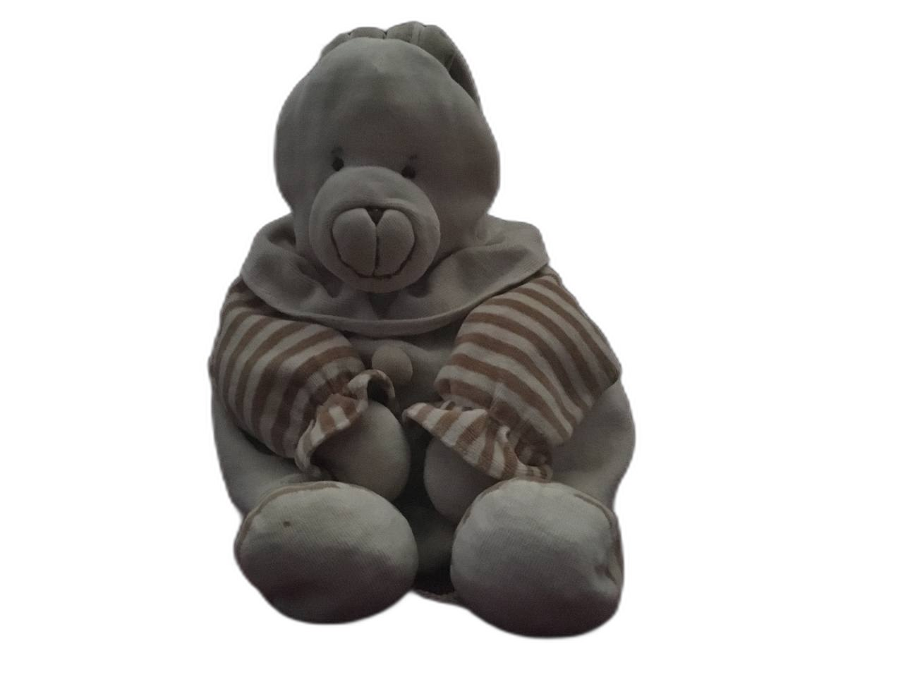
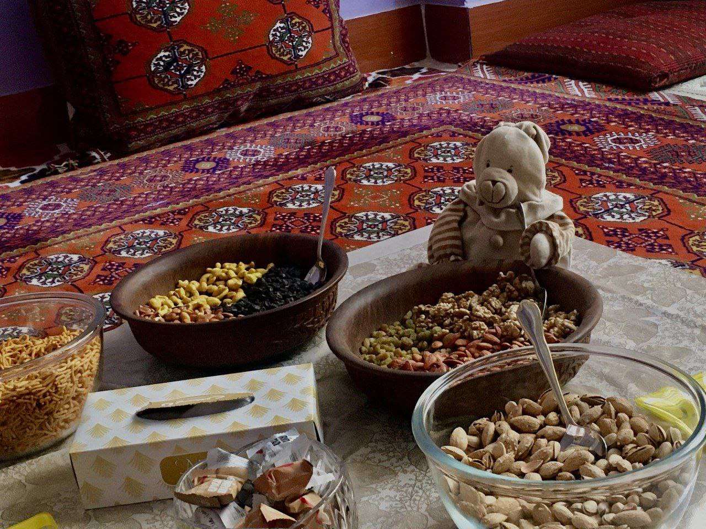
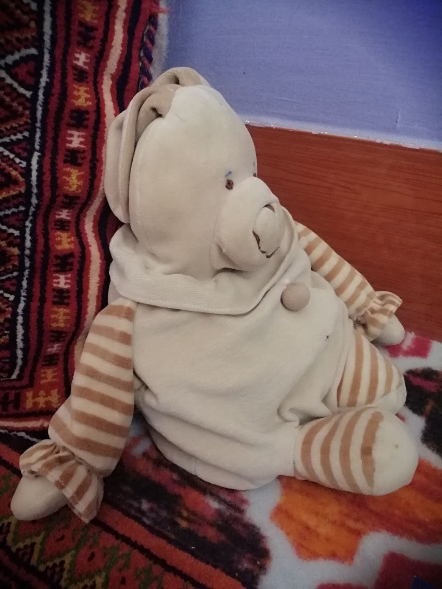
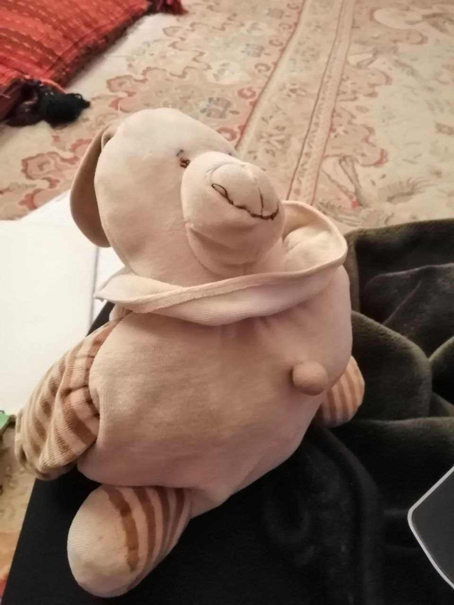
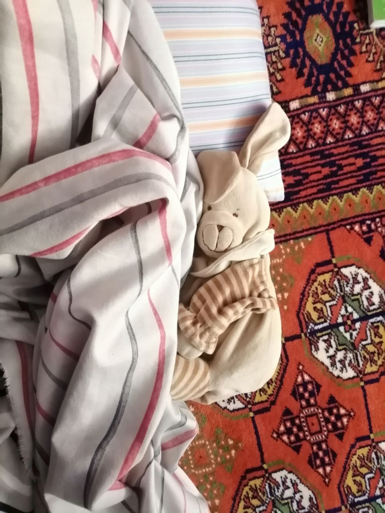
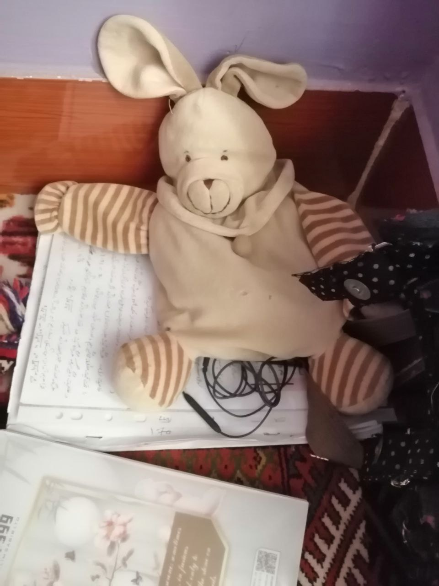

<!DOCTYPE html>
<html lang="en">
<head>
    <meta charset="UTF-8">
    <meta http-equiv="X-UA-Compatible" content="IE=edge">
    <meta name="viewport" content="width=device-width, initial-scale=1.0">
    <title>Teddy Bear 🐻</title>
    
</head>
<body>
    <h1>
        🐻 Everything about teddy bears 🐻
    </h1>
    

    

        The name teddy bear comes from Theodore Roosevelt, the 26th president of the United States, who was often referred to as "Teddy" (a nickname he loathed).
        The name originated from an incident on a bear-hunting trip in the U.S. state of Mississippi in November 1902, to which Roosevelt was invited by Andrew H.
        Longino, the 35th governor of Mississippi. There were several other hunters competing, and most of them had already killed an animal. A party of Roosevelt's attendants, 
        led by Holt Collier,[4] cornered, clubbed, and tied an American black bear to a willow tree after a long and exhausting chase with hounds. They called Roosevelt to the 
        site and suggested that he should shoot the bear dead, although Collier told Roosevelt not to shoot the bear while it was tied.[5] Roosevelt refused to shoot the bear 
        himself, deeming this unsportsmanlike, but instructed that the bear be killed to put it out of its misery,[6][7] and it became the topic of a political cartoon by 
        Clifford Berryman in The Washington Post on November 16, 1902.[8][9][10] While the initial cartoon of an adult black bear lassoed by a handler and a disgusted Roosevelt had symbolic overtones, later issues of that and other Berryman cartoons made the bear smaller and cuter.
    

  <h2>Types of Teddy Bears</h2>
  
  
  <ol>
    <li>
      <strong>Classic Stuffed Animals</strong>
      <dl>
        <dt><strong>Material</strong></dt><dd>Soft plush fabric, often filled with polyester fibers</dd>
        <dt><strong>Size</strong></dt><dd>Available in various sizes from small to giant</dd>
        <dt><strong>Customization</strong></dt><dd>Comes in various colors and styles</dd>
      </dl>
    </li>

    <li>
      <strong>Collectible Teddy Bears</strong>
      <dl>
        <dt><strong>Editions</strong></dt><dd>Often released in small batches</dd>
        <dt><strong> Designs</strong></dt><dd>Features intricate embroidery and artistic touches</dd>
        <dt><strong>Value Appreciation</strong></dt><dd>Some collectible bears increase in value over time</dd>
      </dl>
    </li>

    <li>
      <strong>DIY Teddy Bear Kits</strong>
      <ul>
        <li>Includes all materials and tools for assembly</li>
        <li>Available in various themes (animals, fantasy, etc.)</li>
        <li>Encourages creativity and gives a sense of accomplishment</li>
      </ul>
      <strong>Tips for Selecting:</strong>
      <ul>
        <li>Choose a kit with clear instructions</li>
        <li>Consider the age of the maker</li>
        <li>Look for themed kits to match interests</li>
      </ul>
    </li>

    <li>
      <strong>Interactive Teddy Bears</strong>
      <dl>
        <dt><strong>Voice Recording</strong></dt><dd>Can record and play messages</dd>
        <dt><strong>Movement</strong></dt><dd>Some move or respond to touch</dd>
        <dt><strong>Functions</strong></dt><dd>Teach letters, numbers, and songs</dd>
      </dl>
    </li>

    <li>
      <strong>Plush Teddy Bears</strong>
      <dl>
        <dt><strong>Softness</strong></dt><dd>Made with extra plush materials</dd>
        <dt><strong>Durability</strong></dt><dd>High-quality stitching</dd>
        <dt><strong>Variety</strong></dt><dd>Available in different sizes and styles</dd>
      </dl>
    </li>

    <li>
      <strong>Teddy Bear Accessories</strong>
      <ul>
        <li><strong>Clothing:</strong> Dresses, hats, or costumes</li>
        <li><strong>Carriers:</strong> Bags or backpacks</li>
        <li><strong>Decorative Items:</strong> Bow ties, collars, tags</li>
      </ul>
    </li>
  </ol>
  <a href="https://en.wikipedia.org/wiki/Teddy_bear"><strong>For more details about teddy bears click here</strong></a>
    <a href="https://www.myntra.com/teddy-bear"><strong>For more teddy bear's photos</strong></a>

  

    
<strong>But my childhood and favorite teddy bear is something else</strong>

    

        The name of my teddy bear is Babali, I give her this name myself. I've written about her everywhere and mentioned her in every conversation, and it's because of Babali that I wanted to 
        make my first project about teddy bears. Since the moment I became aware of myself, I've lived with Babali. She's shared every moment and memory with me.
        She's become very old and worn out 😥, but to me, She becomes more precious every single day 😊.
        I love you, my Babali 😍😍.

      <strong>Babali's recently photos</strong>
    

        
        
        
        
        
        
    

   
 
</body>
</html>
